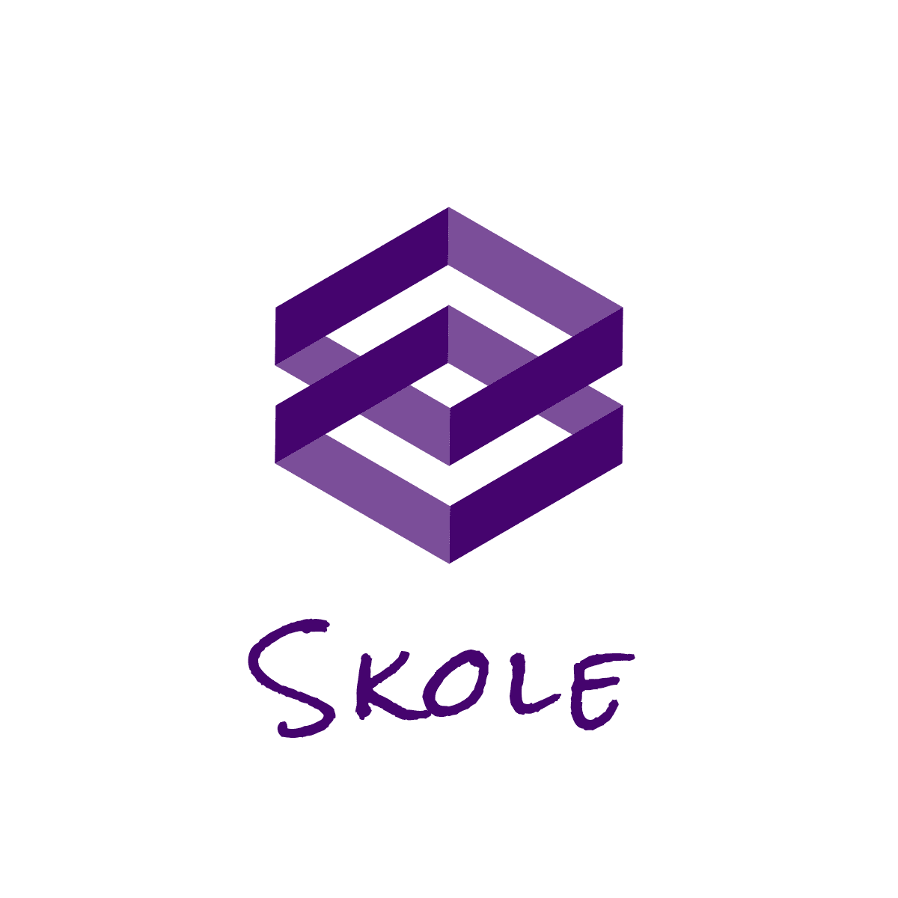

[](https://github.com/DevJoaoLopes/Skoole/stargazers)
[](https://github.com/DevJoaoLopes/Skoole)
[](https://github.com/DevJoaoLopes/Skoole/issues)
[](https://github.com/DevJoaoLopes/Skoole/network)

## Index

- [Index](#tabela-de-conte%C3%BAdo)
- [About](#sobre-o-projeto)
- [Getting Started](#come%C3%A7ando)
  - [Install](#instala%C3%A7%C3%A3o)

<!-- ABOUT THE PROJECT -->

## About

Application to help students to enter colleges, integrating them with communities, study groups and making educational materials available.


<!-- GETTING STARTED -->

## Getting Started

Para conseguir executar o projeto, clone o projeto e siga os passos abaixo.

### Instalação

1. You must have the following tools:

- Node.js + NPM
- React Native
- JDK 8
- Android Studio / Genymotion for Emulator

2. Run Commands: 

```sh
yarn install
```

```sh
yarn start --reset-cache
```
**Android**

```sh
yarn android 
```

**IOS**

```sh
yarn ios
```
